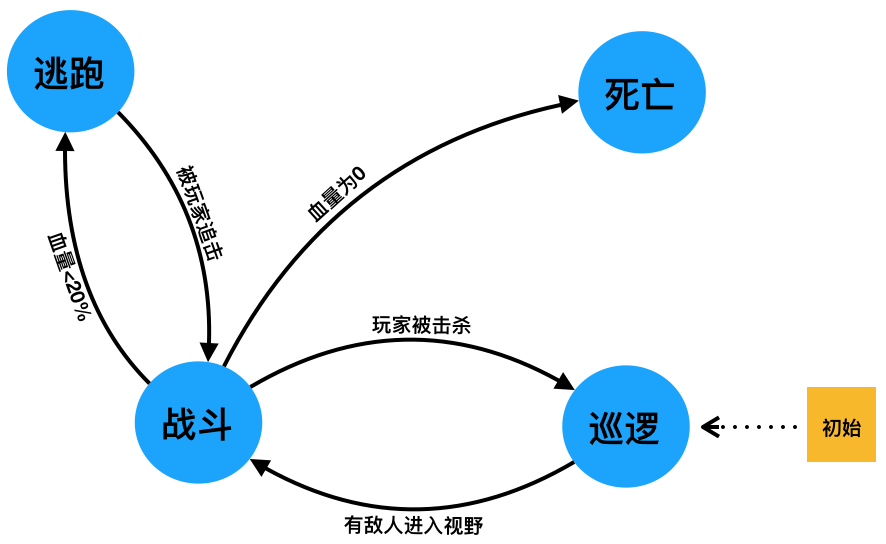

## FSM 例子


以一个简单的游戏中敌人AI为例子



state: `['dead', 'run', 'fight', 'patrol']`

event: `['inKen', 'killPlayer', 'volumeLess20', 'beChased', 'volumeis0']`

（中式英语将就看）

```typescript
import { FiniteStateMachine } from '@awefeng/state-machine'

const actionCallback = ({ from, to, event }) => {
  console.log('action', from, to, event)
}

const pawnFsm = new FiniteStateMachine({
  state: 'patrol',
  transitions: [
    { event: 'inKen', from: 'patrol', to: 'fight', action: actionCallback },
    {
      event: 'killPlayer',
      from: 'fight',
      to: 'patrol',
      action: actionCallback
    },
    { event: 'volumeLess20', from: 'fight', to: 'run', action: actionCallback },
    { event: 'beChased', from: 'run', to: 'fight', action: actionCallback },
    { event: 'volumeIs0', from: 'fight', to: 'dead', action: actionCallback }
  ],
  onTransiteError: ({ from, to, event }) => {
    console.log('转换错误:', from, to, event)
  }
})

// 获取当前状态
pawnFsm.getState()
// 'patrol'

// 失败 巡逻状态下没有 血量小于20 的触发
pawnFsm.canTransite('volumeLess20') && pawnFsm.transite('volumeLess20')

// 巡逻状态转为战斗
pawnFsm.canTransite('inKen') && pawnFsm.transite('inKen')

// 玩家被杀
pawnFsm.transite('killPlayer')
// true

// 重新修改为战斗状态
pawnFsm.setState('fight')

// 获取当前状态（“战斗”）下的转换
pawnFsm.getStateTransitions()
// {event: 'killPlayer', from: 'fight', to: 'patrol', action: ƒ}
// {event: 'volumeLess20', from: 'fight', to: 'run', action: ƒ}
// {event: 'volumeIs0', from: 'fight', to: 'dead', action: ƒ}

// 战斗状态下血量小于20
pawnFsm.transite('volumeLess20')
// true

// 转换错误
pawnFsm.transite('killPlayer') // false

// 被玩家追击
pawnFsm.transite('beChased')

// 血量为0
pawnFsm.transite('volumeIs0')

// 转换历史
pawnFsm.getHistory()
// 0: {from: 'patrol', to: 'fight', event: 'inKen', type: 'transite'}
// 1: {from: 'fight', to: 'patrol', event: 'killPlayer', type: 'transite'}
// 2: {from: 'patrol', to: 'fight', type: 'setState', event: ''}
// 3: {from: 'fight', to: 'run', event: 'volumeLess20', type: 'transite'}
// 4: {from: 'run', to: 'fight', event: 'beChased', type: 'transite'}
// 5: {from: 'fight', to: 'dead', event: 'volumeIs0', type: 'transite'}
```
